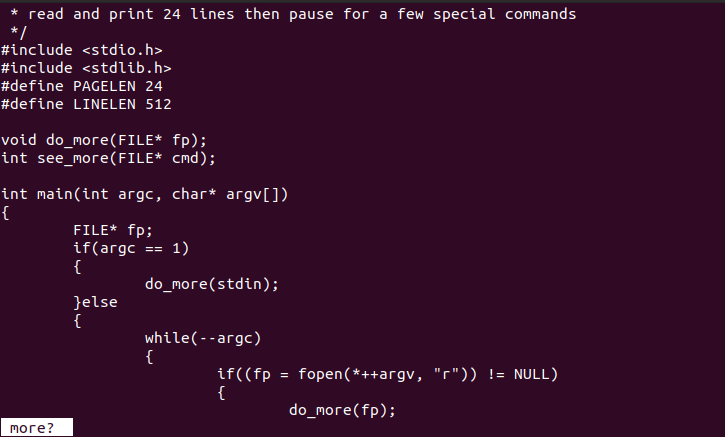
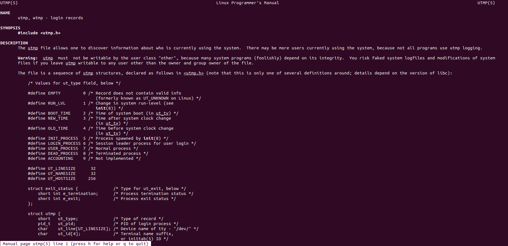

# Unix-Programming-Learning

**All programs in this repo are from book *Understanding Unix/Linux Programming* written by Pro. Bruce Molay**


And in order to learn Unix programming, I **rewrote the programs** in the book by myself. This project includes how to implement **simple system commands** in the Unix environment, learn **Shell** programming, understand **how Unix works** and use **Unix library** programming.

## 1. more

## 2. who 
find utmp structure by 
```shell
man 5 utmp
```

